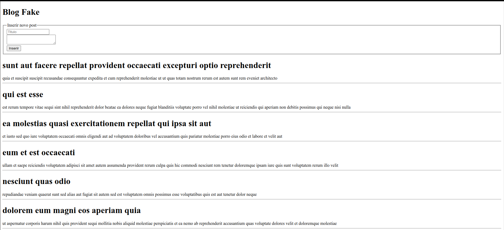

# Blog-Fake

This is the input project in the requests, in which I fetch the site [JsonFake](https://jsonplaceholder.typicode.com/posts), the challenge is to create a blog with this data. I tried to use the best practices.

  

